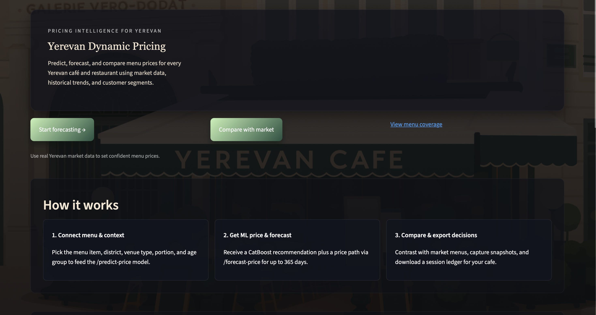
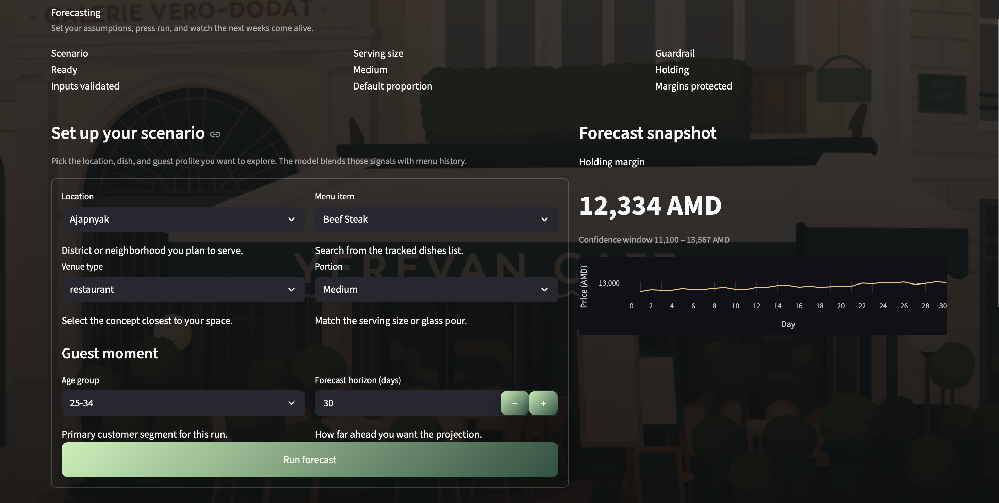
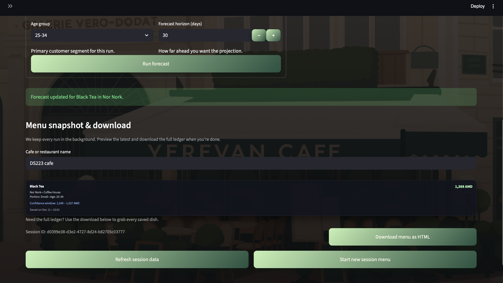
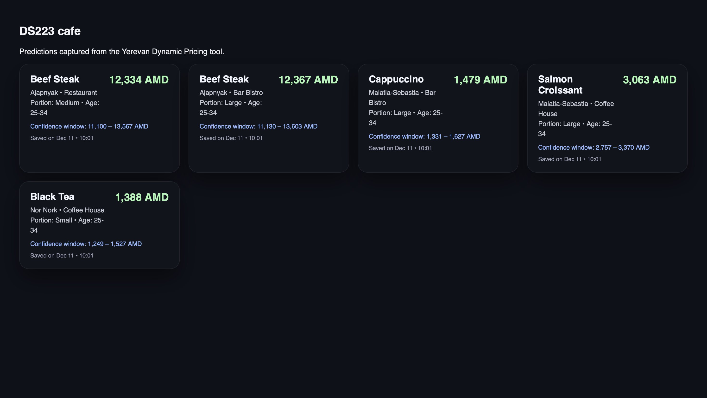
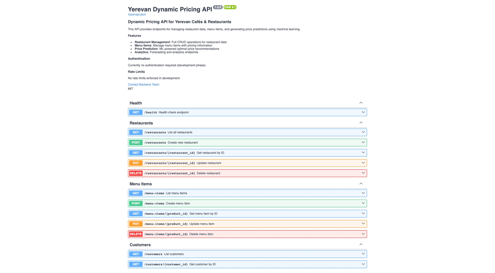
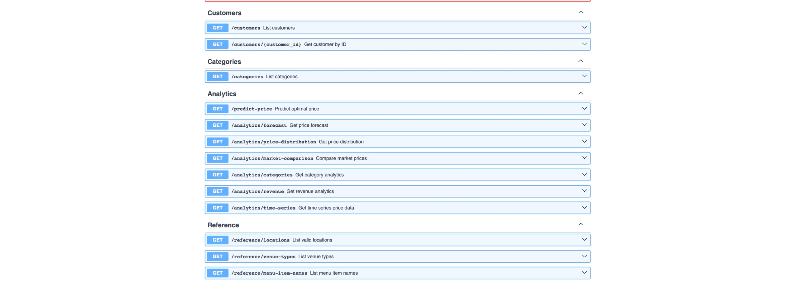
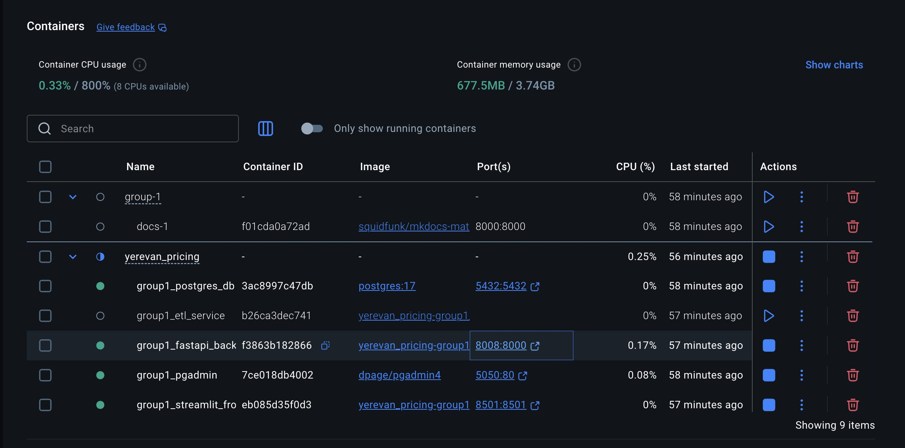

# 📊 Dynamic Pricing for Yerevan Cafés & Restaurants  
### **DS223 — Marketing Analytics**  
### American University of Armenia

---

## 📚 Documentation

**[📖 View Full Documentation](https://ds-223-2025-fall.github.io/group-1/)**

---

## 📖 Project Description

This project implements a complete **dynamic pricing platform** for Yerevan cafés and restaurants, developed for **DS223 – Marketing Analytics** under the supervision of **Instructor Karen Hovhannisyan**.

The platform provides **ML-powered price predictions** and **forecasting** for menu items using a service-based architecture that includes:

- **CatBoost ML Model** for price prediction
- **ETL Pipeline** for data processing
- **FastAPI Backend** with RESTful endpoints
- **Streamlit Frontend** for interactive dashboards
- **PostgreSQL Database** with star schema design

---


## 🚀 Running Instructions

### Prerequisites
- Docker & Docker Compose installed
- Git

### Quick Start

```bash
# Clone the repository
git clone https://github.com/DS-223-2025-Fall/group-1.git
cd group-1

# Start all services
cd yerevan_pricing
docker-compose up --build
```

### Access the Services

| Service | URL | Description |
|---------|-----|-------------|
| **Streamlit UI** | http://localhost:8501 | Interactive pricing dashboard |
| **FastAPI Swagger** | http://localhost:8008 | API documentation & testing |
| **PgAdmin** | http://localhost:5050 | Database management |

---

## 👥 Team Members

| Role | Name |
|------|------|
| Product Manager | Shushan Meyroyan |
| Database Developer | Arina Hovhannisyan |
| Backend Developer | Narek Nurijanyan |
| Frontend Developer | Areg Khachatryan |
| Data Scientist | Shushan Gevorgyan |

---

## 🛠️ Technologies Used

- **Python** (Pandas, NumPy, scikit-learn, CatBoost)  
- **FastAPI**  
- **Streamlit**  
- **PostgreSQL**  
- **Docker & Docker Compose**  
- **MkDocs Material**
- **GitHub PR workflow**  
---







